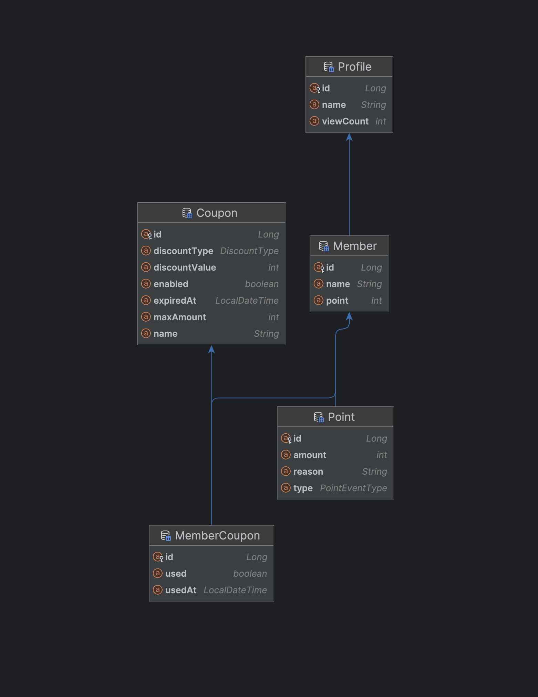

# API 문서

###  1. 프로필 목록 조회

`GET /api/profiles`

```
http://localhost:8080/api/profiles?page=0&size=2&sort=count
```

&nbsp;
* 프로필 리스트를 페이지네이션 및 정렬 조건에 맞게 조회합니다.
* 요청 파라미터 (Query Params)

  | 이름 | 타입 | 필수 여부 | 설명 | 기본값           | 제약조건 |
    |---|---|---|---|---------------|---|
  | `page` | `int` | 아니오 | 조회할 페이지 번호 (0부터 시작) | `0` | `0` 이상 `1000000` 이하 |
  | `size` | `int` | 아니오 | 페이지 크기 (한 페이지에 보여줄 항목 수) | `10` | `1` 이상 `100` 이하 |
  | `sort` | `string` | 아니오 | 정렬 조건 (`name`, `view`, `newest`) | 빈 문자열 (newest정렬) | |
&nbsp;

---

### 2. 프로필 상세 조회

`GET /api/profiles/{id}`

```
http://localhost:8080/api/profiles/1
```

&nbsp;
- 정상 응답 (200 OK)

```json
{
  "code": 200,
  "status": "OK",
  "message": "OK",
  "data": {
    "id": 1,
    "name": "홍길동1",
    "viewCount": 1,
    "createdAt": "2025-06-21T20:30:00"
  }
}
```

&nbsp;
- 예외 응답

| 응답 코드 |      상황       | 메시지               |
|:-----:|:-------------:|-------------------|
| 404	  | 해당 ID의 프로필 없음 | 	entity not found |  

&nbsp;

---
### 3. 결제 승인 요청

`POST /api/payments/confirm`  
&nbsp;

body 입력값

```json
{
  "memberId": 1,
  "paymentKey": "something_from_toss_SDK",
  "orderId": "order-****",
  "amount": 10000,
  "provider": "toss",
  "memberCouponId": 2
}
```

| 필드명          | 타입        | 	필수 | 설명                   |
|--------------|-----------|:---:|----------------------|
| `memberId`   | 	`Long`   | 	✅  | 	결제를 요청한 회원 ID       |
| `paymentKey` | 	`String` | 	✅  | 	PG사 결제 키            |
| `orderId`	   | `String`  | 	✅  | PG사 주문 ID            |
| `amount`	    | `int`     | 	✅	 | 충전 금액 (1원 이상)        |
| `provider`	  | `String`  | 	✅  | 	결제 시스템 제공자 (toss 등) |

&nbsp;
- 정상응답 (200 OK)

```json
{
  "code": 200,
  "status": "OK",
  "message": "OK",
  "data": {
    "paymentKey": "tviva2025072404055071Te8",
    "orderId": "ORDER-1753297549510",
    "totalAmount": 1000,
    "status": "DONE",
    "paymentDisApproved": false
  }
}
```

&nbsp;
- 예외 응답

| 응답 코드 |     	상황 	      | 메시지                  |
|:-----:|:--------------:|----------------------|
| 400	  |    누락된 필드	     | 회원 ID는 필수입니다.        |
| 400	  |    잘못된 금액	     | 충전 금액은 1원 이상이어야 합니다. |
| 400	  |  provider 누락	  | 결제 시스템 제공자는 필수입니다.   |
| 404	  | 쿠폰 ID 존재하지 않음	 | 해당 쿠폰이 존재하지 않습니다.    |
| 500	  |   PG사 응답 오류	   | 결제 승인에 실패했습니다.       |

&nbsp;

---
### 4. 포인트 충전
`POST /api/points/charge`  
&nbsp;

body 입력값
```json
{
  "memberId": 1,
  "memberCouponId": null,
  "amount": 1000,
  "reason": "충전"
}
```


---
### 5. 사용 가능한 쿠폰 조회 API

`GET /api/member-coupons/{memberId}/available`

```
http://localhost:8080/api/member-coupons/1/available
```
&nbsp;

- 회원이 보유한 사용 가능한 쿠폰 목록을 조회합니다.
    - (결제 전에 적용 가능한 쿠폰을 고를 수 있도록 제공)


- 정상 응답

```json
{
  "code": 200,
  "status": "OK",
  "message": "OK",
  "data": [
    {
      "memberCouponId": 2,
      "couponId": 2,
      "name": "정률할인쿠폰",
      "discountValue": 20,
      "discountType": "PERCENT",
      "maxAmount": 5000,
      "used": false,
      "usedAt": null,
      "expiredAt": "2025-08-08T05:17:58"
    }
    // ...
  ]
}
```
&nbsp;
- 조회 0 건도 정상처리

- 필드 설명

  | 필드               | 타입        | 설명                      |
    | ---------------- | --------- |-------------------------|
  | `memberCouponId` | `Long`    | 회원이 보유한 쿠폰 식별자          |
  | `couponId`       | `Long`    | 쿠폰 식별자                  |
  | `name`           | `String`  | 쿠폰 이름                   |
  | `discountValue`  | `int`     | 할인 값 (정률: %, 정액: 원)     |
  | `discountType`   | `String`  | `PERCENT` , `FIXED`     |
  | `maxAmount`      | `int`     | 최대 할인 금액   |
  | `used`           | `boolean` | 사용 여부                   |
  | `usedAt`         | `String`  | 사용 일시 (사용 안 했으면 `null`) |
  | `expiredAt`      | `String`  | 만료 일시                   |
&nbsp;
***  
#  테이블

## - ERD 개요

[***member***] ─── (1:1) ───> [***profile***]

[***coupon***]  ─── (1:N) ───> [***member_coupon***] <─── (N:1) ─── [***member***]

[***member***] ─── (1:N) ───> [***point***]  

&nbsp;
- Member
  - 회원 엔티티이며, point ___필드___ 로 보유 포인트를 나타냅니다.
- Profile
  - 회원별 프로필 (이름, 조회수, 등록일)
- Point
  - 포인트 충전 및 사용 이력을 기록
- Coupon
  - 할인 쿠폰 정의 (정액/정률, 최대할인)
- MemberCoupon
  - 회원이 발급받은 쿠폰 (만료일, 사용 여부 포함)  



  

## - DDL  

- 상세 보기 - [[링크]](https://github.com/kanghowoo/my-real-store/blob/main/src/main/resources/schema.sql)
- 요약  

| 테이블명            | 주요 필드 요약                                                                                      | 요약 설명                                                                          |
| --------------- | --------------------------------------------------------------------------------------------- |--------------------------------------------------------------------------------|
| `member`        | `id`, `name`, `profile_id (nullable)`, `point`, `created_at`                                  | `profile_id`는 `UNIQUE`, `profile(id)` 외래키 참조                                   |
| `profile`       | `id`, `name`, `view_count`, `created_at`                                                      | 인덱스: `name`, `view_count`, `created_at`                                        |
| `coupon`        | `id`, `name`, `discount_type (ENUM)`, `discount_value`, `max_amount`, `expired_at`, `enabled` | 할인 타입은 ENUM(`FIXED`,`PERCENT`), `enabled`은 활성 상태 여부                            |
| `member_coupon` | `id`, `member_id`, `coupon_id`, `used`, `used_at`, `created_at`                               | 인덱스: `member_id`, `coupon_id`, **`(member_id, used, updated_at, created_at)`** |
| `point`         | `id`, `amount`, `type (ENUM)`, `reason`, `member_id`, `created_at`                            | 인덱스: `member_id` , 타입은 ENUM(`CHARGE`, `USE`)                                   |

&nbsp;
***
# 실행 가이드
&nbsp;
### 명령어 및 접속정보  

1. Docker 및 Docker Compose 설치

2. 프로젝트 루트에서 Docker Compose 실행
```
docker compose up --build
```
&nbsp;
3. 서버 접속 정보  

| 항목      | 값                            |
| ------- |------------------------------|
| API 서버  | `http://localhost:8080`      |
| DB Host | `localhost` (또는 `127.0.0.1`) |
| DB Port | `3307`                       |
| DB Name | `myrealstore`                |
| DB 사용자명 | `test`                       |
| DB 비밀번호 | `1234`                       |

&nbsp;
4. 확인용 명령어
```
docker logs myrealstore-app
```
```
docker logs myrealstore-mysql
```

### 초기 데이터
&nbsp;
초기 데이터는 src/main/resources/data.sql을 통해 자동 삽입됩니다.  
JPA 설정(spring.sql.init.mode=always, ddl-auto=none)에 따라 실행 시점에 데이터가 입력되며, 테스트 및 기능 검증용 데이터를 포함하고 있습니다.

 - data.sql - [[링크]](https://github.com/kanghowoo/my-real-store/blob/42b229018dc6d81cd0d18bc7636e108dd7c3f049/src/main/resources/data.sql#L4)

#### 회원 (member)

- 각 회원은 홍길동1 ~ 홍길동10 이름으로 구성

- 각 회원은 고유의 프로필을 보유 (`profile_id`)

- `point` 0 ~ 9000원까지 1000원 단위 증가  

  | id | name  | point | profile\_id |
  | -- | ----- | ----- | ----------- |
  | 1  | 홍길동1  | 0     | 1           |
  | 2  | 홍길동2  | 1000  | 2           |
  | …  | …     | …     | …           |
  | 10 | 홍길동10 | 9000  | 10          |

&nbsp;
#### 프로필 (profile)

- `name` 홍길동1 ~ 홍길동10
- `view_count`는 순서대로 0~9
- `created_at`은 하루 간격 증가

| id | name  | view\_count | created\_at         |
| -- | ----- | ----------- | ------------------- |
| 1  | 홍길동1  | 0           | 2025-06-21 20:30:00 |
| 2  | 홍길동2  | 1           | 2025-06-22 20:30:00 |
| …  | …     | …           | …                   |
| 10 | 홍길동10 | 9           | 2025-06-30 20:30:00 |
&nbsp;
#### 쿠폰 (coupon)

- `FIXED`(정액할인쿠폰): `1,000`원 할인
- `PERCENT`(정률할인쿠폰): `20%` 할인 (최대 `5,000`원)
- `expired_at`: 생성 시점으로부터 30일 뒤  

  | id | name   | type    | value | maxAmount | enabled | expiredAt     |
  | -- | ------ | ------- | ----- | --------- | ------- | ------------- |
  | 1  | 정액할인쿠폰 | FIXED   | 1000  | 1000      | true    | `NOW() + 30일` |
  | 2  | 정률할인쿠폰 | PERCENT | 20    | 5000      | true    | `NOW() + 30일` |
&nbsp;
#### 회원-쿠폰 매핑 (member_coupon)
- 모든 회원이 두 개의 쿠폰을 소유 (총 20개)
- `used`는 모두 `false  

| id | member\_id | coupon\_id | used  |
| -- | ---------- | ---------- | ----- |
| 1  | 1          | 1          | false |
| 2  | 1          | 2          | false |
| …  | …          | …          | …     |
| 20 | 10         | 2          | false |  


&nbsp;
#### 포인트 (Point)
- 초기값 없음
- 포인트 충전/사용 시 기록됨 (`CHARGE`, `USE`)

| id | member\_id | amount | type | reason | created\_at | updated\_at |
|---| ---------- | ------ | ---- | ------ | ----------- | ----------- |
| - | –          | –      | –    | –      | –           | –           |

